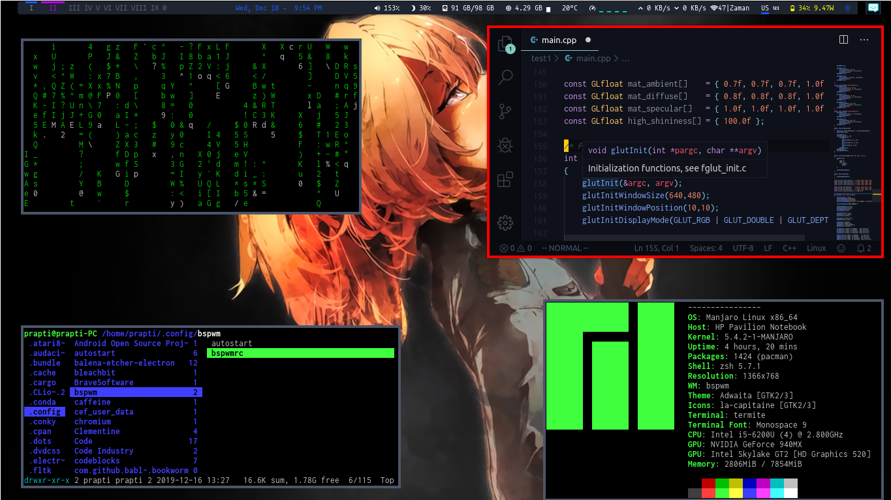

# My Linux dots
This are my daily using Linux configuration files.

# Screenshot


# Specifications
* **OS**: Manjaro-bspwm
* **WM**: BSPWM
* **Bar**: Polybar
* **Terminal**: Termite
* **Wallpapers**: Babywogue ([flickr](https://www.flickr.com/photos/137082737@N08/albums/72157661521826824/))

# Setup
List software I use can be found [here](requirement-pkgs.txt).

I have used [Harfang](https://harfangk.github.io/about/)'s [method](https://harfangk.github.io/2016/09/18/manage-dotfiles-with-a-git-bare-repository.html) to store my configs on github. As his suggestion, enter the command
```bash
dotfiles config --local status.showUntrackedFiles no
```
to ignore other files in the home directory.

# Note that...
This is a very WIP. Full details on how to use this will be covered later (probably with a video and updated README).